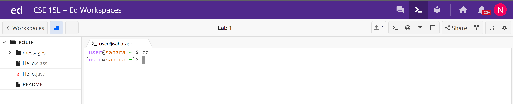
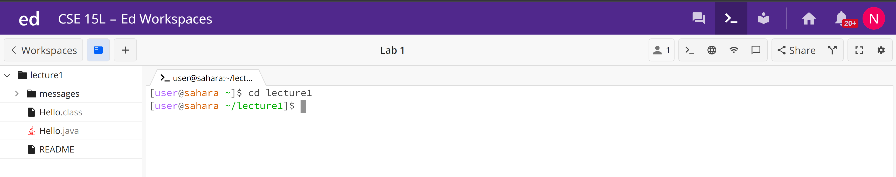
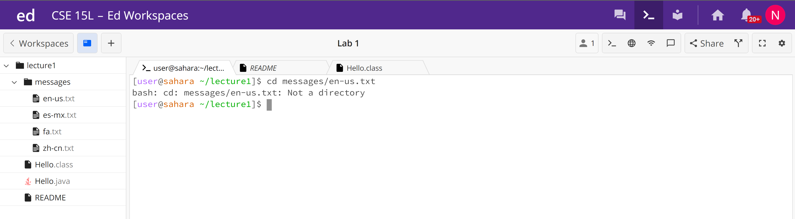
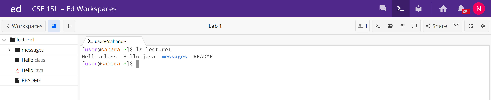
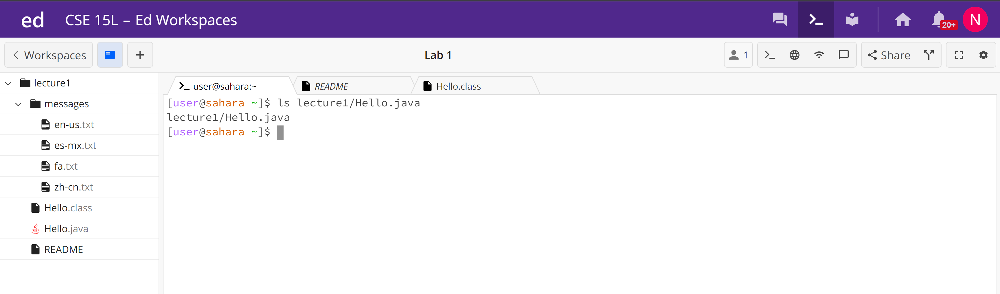
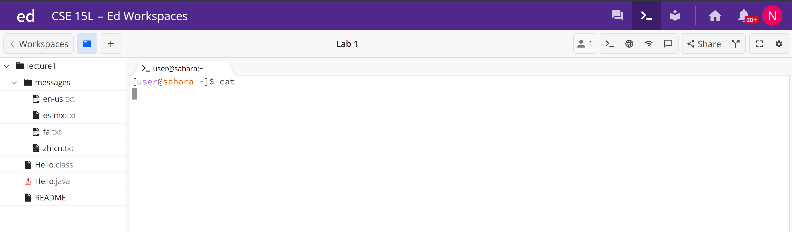
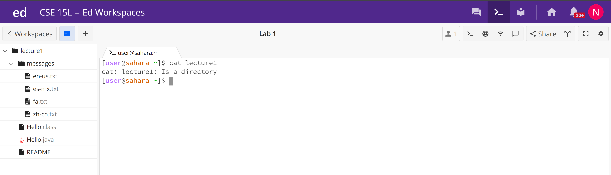
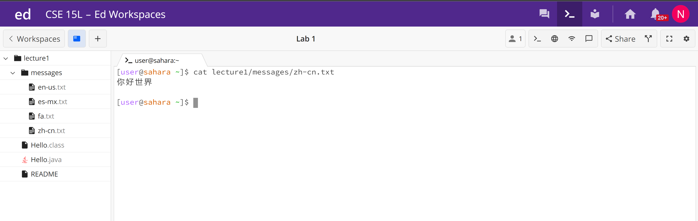

# CSE 15L Lab 1
## Kavon Naziri - A17499205

1. `cd` (no argument)  

- When the command was run the working directory was `/home`
- When the command `cd` is executed with no argument it is automatically run as if the argument is home directory. Seeing as the working directory is already `/home`, nothing changes in the terminal once the command is run.
- The output is not an error

2. `cd` (path to a directory as an argument)

- When the command was run the working directory was `/home`
- When the command `cd` is run with a path to a directory as an argument, the working directory changes to that directory. This is denoted by a change in the terminal prompt to show the new working directory.
- The output is not an error

3. `cd` (path to a file as an argument)

- When the command was run the working directory was `/home/lecture1`
- When the command `cd` is run with a path to a file as an argument, the terminal prints a message saying that the path is not a directory. This is because the path leads to a file which is in fact not a directory and the working directory cannot be changed to a file.
- The output is an error because the purpose of cd is to change the workign directory and seeing as a file is not a directory, the working directory cannot be changed when a file path is used as an argument.

4. `ls` (no argument)

- When the command was run the working directory was `/home`
- In this case when the command `ls` is run with no argument, the terminal prints a list of the contents of the working directory. Becuase the working directory is `/home`, the terminal lists the contents of `/home`, `lecture1`.
- The output is not an error

5. `ls` (path to a directory as an argument)

- When the command was run the working directory was `/home`
- Running `ls` with a path to a directory as an argument lists the contents of that directory. As such, in this case the contents of `/home/lecture1` are printed as this is the path used as an argument.
- The output is not an error

6. `ls` (path to a file as an argument)

- When the command was run the working directory was `/home`
- Running the `ls` command with a file path as the argument simply reprints the file path to the terminal. In this case a relative path is printed but `ls` would also print an absolute path if given an absolute file path as an argument. Seeing as there are no contents of the file to list, this command does not list any directories or files as it normally would.
- This output is not an error

7. `cat` (no argument)
 
- When the command was run the working directory was `/home`
- Running `cat` with no argument provides no terminal output nor does the terminal provide a prompt after the fact. There is simply a cursor which allows the user to type freely into the terminal. Typing into the terminal and pressing `Enter` simply duplicates the text input in the terminal. 
- This output is not an error

8. `cat` (path to a directory as an argument)

- When the command was run the working directory was `/home`
- Running `cat` with a directory path as an agument prints a message to the terminal telling the user that the path is in fact a directory. This is because `cat` can only print or concatinate files, not directories.
- This output is an error because cat cannot execute with a directory path as an argument

9. `cat` (path to a file as an argument)

- When the command was run the working directory was `/home`
- Running cat with a singular file path as an argument prints the contents of that file to the terminal. Should there have been multiple file paths this command would have concatinated the contents of these files.
- This output is not an error 

