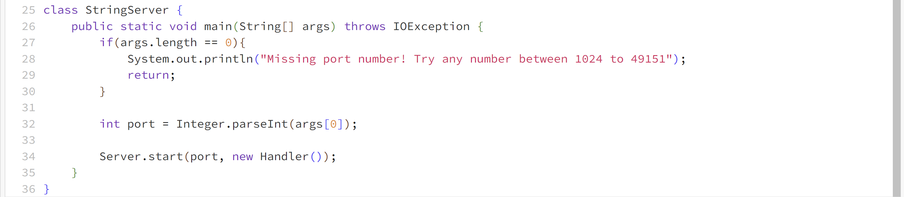

# CSE 15L Lab Report 2
## Kavon Naziri - A17499205

### Part 1

Code:

Screenshot 1:

- In this first screenshot the method handleRequest(URI url) within the Handler class is called
- The entire url passes as an argument to this method. The method url.getPath() returns the path "/add-message" making the first boolean in the handlRequest method true. The method url.getQuery returns the query "s=Hello" which is then split into the string array called parameters as follows: ["s", "Hello']. Because the element at index 0 of parameters is in fact "s", the instance variable numMessages increments by one and the formatted string including the bullet point number, the message (parameters[1]), and a line break is concatanated to the string message which is then returned.
- The instance variable numMessages increments from 0 to 1 and the the instance variable messages becomes "1. Hello\n"

Screenshot 2:

