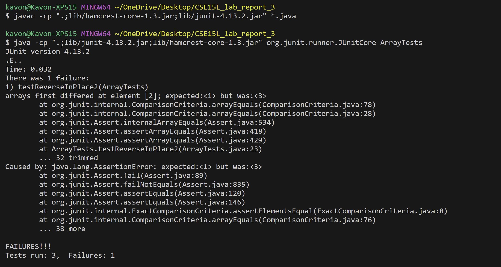

# CSE 15L Lab Report 3
## Kavon Naziri - A17499205

# Part 1
1. Failure Inducing Input
```
@Test
  public void testReverseInPlace2() {
    int[] input1 = {1,2,3};
    ArrayExamples.reverseInPlace(input1);
    assertArrayEquals(new int[]{3,2,1}, input1);
  }
```
2. Non-Failure Inducing Input
```
@Test
  public void testReverseInPlace() {
    int[] input1 = { 3 };
    ArrayExamples.reverseInPlace(input1);
    assertArrayEquals(new int[]{ 3 }, input1);
  }
```
3. Failure Ouput


4. Bug before and after:<br>
Before:
```
static void reverseInPlace(int[] arr) {
    for(int i = 0; i < arr.length; i += 1) {
      arr[i] = arr[arr.length - i - 1];
    }
  }
```
After:
```
static void reverseInPlace(int[] arr) {
    for(int i = 0; i <= arr.length/2 - 1; i += 1) {
      int temp = arr[i];
      arr[i] = arr[arr.length - i - 1];
      arr[arr.length - i - 1] = temp;
    }
  }
```
The reverseInPlace method works by switching opposite elements in the array. The buggy implementation iterates through the entire array and at a given index will put the opposing value in the array at that index but will not replace the value at the opposing index. The debugged implentation itterates through half of the array and stores stores the value at a given index as a temp variable such that it can be placed at the opposing index. 

# part 2

1. less -a ([Source for less -a](https://man7.org/linux/man-pages/man1/less.1.html))

```
$ less -a technical
technical is a directory
```

less -a does not work for directories

```
less -a techical/911report/chapter-1.txt

"WE HAVE SOME PLANES"

    Tuesday, September 11, 2001, dawned temperate and nearly cloudless in the eastern United States. Millions of men and women readied themselves for work. Some made their way to the Twin Towers, the signature structures of the World Trade Center complex in New York City. Others went to Arlington, Virginia, to the Pentagon. Across the Potomac River, the United States Congress was back in session. At the other end of Pennsylvania Avenue, people began to line up for a White House tour. In Sarasota, Florida, President George W. Bush went for an early morning run.

    For those heading to an airport, weather conditions could not have been better for a safe and pleasant journey. Among the travelers were Mohamed Atta and Abdul Aziz al Omari, who arrived at the technical/911report/chapter-1.txt...skipping...
```

The -a option allows for skipping through a file

2. less -s ([Source for less -s](https://man7.org/linux/man-pages/man1/less.1.html))

```
$ less -s technical
technical is a directory
```

less -s does not work for directories

```
$ less -s technical/911report/chapter-2.txt

 THE FOUNDATION OF THE NEW TERRORISM
            A DECLARATION OF WAR
            In February 1998, the 40-year-old Saudi exile Usama Bin Ladin and a fugitive Egyptian    
                physician, Ayman al Zawahiri, arranged from their Afghan headquarters for an Arabic  
                newspaper in London to publish what they termed a fatwa issued in the name of a      
                "World Islamic Front." A fatwa is normally an interpretation of Islamic law by a     
                respected Islamic authority, but neither Bin Ladin, Zawahiri, nor the three others   
                who signed this statement were scholars of Islamic law. Claiming that America had    
                declared war against God and his messenger, they called for the murder of any        
                American, anywhere on earth, as the "individual duty for every Muslim who can do it  
                in any country in which it is possible to do it."

            Three months later, when interviewed in Afghanistan by ABC-TV, Bin Ladin enlarged on     
                these themes.

            He claimed it was more important for Muslims to kill Americans than to kill other        
                infidels." It is far better for anyone to kill a single American soldier than to     
                squander his efforts on other activities," he said. Asked whether he approved of     
                terrorism and of attacks on civilians, he replied:"We believe that the worst thieves 
                in the world today and the worst terrorists are the Americans. Nothing could stop    
                you except perhaps retaliation in kind. We do not have to differentiate between      
                military or civilian. As far as we are concerned, they are all targets." Note:       
                Islamic names often do not follow the Western practice of the consistent use of      
                surnames. Given the variety of names we mention, we chose to refer to individuals by 
                the last word in the names by which they are known: Nawaf al Hazmi as Hazmi, for     
                instance, omitting the article "al" that would be part of their name in their own    
:
```

The -s option squeezes lines to fit within the terminal

3. less -u ([Source for less -u](https://man7.org/linux/man-pages/man1/less.1.html))
 
```
$ less -u technical
technical is a directory
```

less -u does not work for directories

```
$ less -u technical/911report/chapter-3.txt

^M
    ^M
        ^M
            COUNTERTERRORISM EVOLVES^M
            In chapter 2, we described the growth of a new kind of terrorism, and a new terrorist^M  
                organization-especially from 1988 to 1998, when Usama Bin Ladin declared war and^M   
                organized the bombing of two U.S. embassies. In this chapter, we trace the parallel^M
                evolution of government efforts to counter terrorism by Islamic extremists against^M 
                the United States.^M
            We mention many personalities in this report. As in any study of the U.S. government,^M  
                some of the most important characters are institutions. We will introduce various^M  
                agencies, and how they adapted to a new kind of terrorism.^M
            FROM THE OLD TERRORISM TO THE NEW: THE FIRST WORLD TRADE CENTER^M
                BOMBING^M
            At 18 minutes after noon on February 26,1993, a huge bomb went off beneath the two^M     
                towers of the World Trade Center. This was not a suicide attack. The terrorists^M    
                parked a truck bomb with a timing device on Level B-2 of the underground garage,^M   
                then departed. The ensuing explosion opened a hole seven stories up. Six people^M    
                died. More than a thousand were injured. An FBI agent at the scene described the^M   
                relatively low number of fatalities as a miracle.^M
            ^M
            President Bill Clinton ordered his National Security Council to coordinate the^M
                response. Government agencies swung into action to find the culprits. The^M
                Counterterrorist Center located at the CIA combed its files and queried sources^M    
                around the world. The National Security Agency (NSA), the huge Defense Department^M  
                signals collection agency, ramped up its communications intercept network and^M      
                searched its databases for clues.^M
            ^M
            The New York Field Office of the FBI took control of the local investigation and, in^M   
technical/911report/chapter-3.txt
```

The -u option causes backspaces and carriage returns to be treated as printable characters

4. less -w ([Source for less -w](https://man7.org/linux/man-pages/man1/less.1.html))

```
$ less -w technical
technical is a directory
```

less -w does not work for directories

```

```

