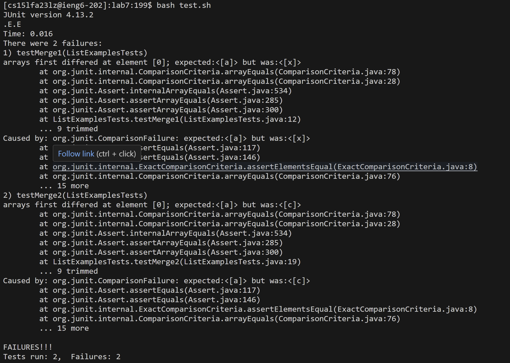
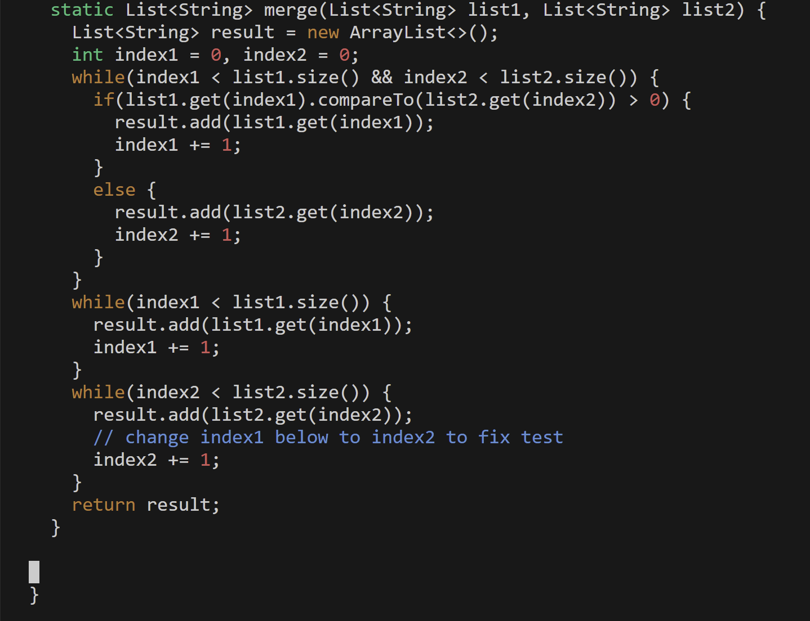
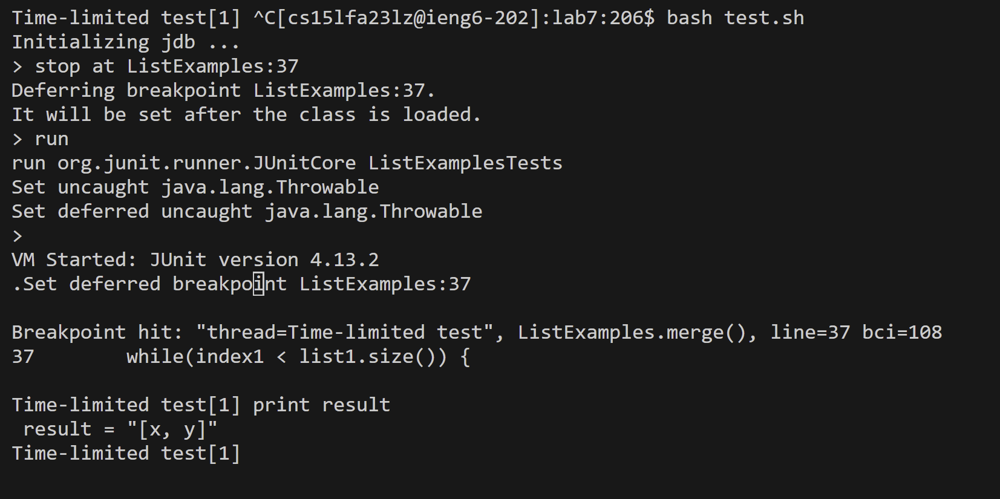
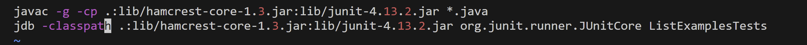
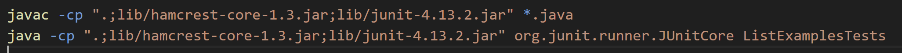

# CSE 15L Lab Report 4
## Kavon Naziri - A17499205

1. Student Edstem Post - Lab 7 ListExamples.java failure

For lab7 whenever I run my tests for the merge method in ListExamples.java using the bash script test.sh, both of my tests fail with this failure message. I also attached my code for my merge method and was hoping someone could help me figure out this bug. 

2. TA response
Take a closer look at your failure messages, do you see anything that could help you figure out what is going on. Is this a bug or a failure in your code. Try using the jdb command (java debugger) to assess the different values in your code as you run it. Don't forget to add the -g option when you compile so that you can have access to the local variables. Also don't forget to use -classpath instead of -cp when running the command.

3. Student Bug Diagnosis

I changed my test.sh file as shown above as to run the java debugger using the jdb command. I also added the -g option the the javac command as to access local variables in the code. When I ran the java debugger I set a breakpoint at line 37 in ListExamples which falls in the middle of my merge method as to see if the bug occured in the first or second half of the method. I then ran the file and printed the local variable result to see what the output was. From this I found that the array result was out of order showing that I flipped the inequality symbol when using the .compareTo method. Switching to the correct inequality symbol fixed the bug.

4. Bug Fix
a. In the end the file structure is the same as before the bug was fixed with the files ListExamples.java, ListExamplesTests.java, and test.sh in the directory lab7
b. The contents of each file before fixing the bug are as follows.

c. code run to trigger and diagnose the bug

d. Description of how to fix the bug
Flipping the inequality sign when .compareTo is used in the merge method fixes the bug and ensures that the final result is a correctly ordered, merged array. 
